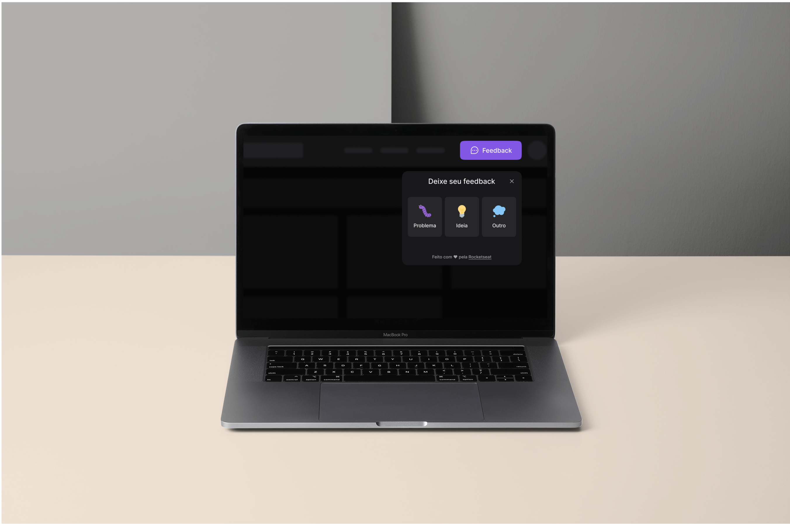

<p align="center">
  
</p>

<p align="center">
  <a href="#-layout">Layout</a> •
  <a href="#-technologies">Technologies</a> •
  <a href="#-getting-started">Getting started</a> •
  <a href="#-license">License</a>
</p>

<p align="center">
  
</p>

## 🔖 Layout

You can view the project layout through the link below:

- [Feedback Widget - Figma](https://www.figma.com/community/file/1102912516166573468)

Remembering that you need to have a [Figma](http://figma.com/) account to access it.

## 🚀 Technologies

- [ReactJS](https://reactjs.org/)
- [Tailwind CSS](https://tailwindcss.com/)
- [TypeScript](https://www.typescriptlang.org/)
- [Vitejs](https://vitejs.dev/)
- [Express](https://expressjs.com/)
- [Prisma](https://www.prisma.io/)

## 💻 Getting started

### Requirements

- [Node.js](https://nodejs.org/en/)
- [Yarn](https://classic.yarnpkg.com/) or [npm](https://www.npmjs.com/package/npm)
- [Expo CLI](https://docs.expo.dev/workflow/expo-cli)

**Clone the project and access the folder**

```bash
git clone https://github.com/matheusm/feedget.git && cd feedget
```

**Follow the steps below**

### Server

```bash
# From the project root folder access the 'server' folder
$ cd server

# Install the dependencies
$ npm install

# Add '.env.local' using this sample:
DATABASE_URL== *put here your postgresql url*

# With a PostgreSQL running, run the migrations
$ npx prisma migrate dev

# Start the server
$ npm run dev
```

### Web

**Make sure to have the server running**

```bash
# From the project root folder access the 'web' folder
$ cd web

# Install the dependencies
$ npm install

# Add '.env.local' using this sample:
VITE_API_URL= *put here your backend url*

# Start the application
$ npm run dev
```

## 📝 License

This project is licensed under the MIT License - see the [LICENSE](LICENSE) file for details.

---

<p align="center">
  Made with 💜 by <a href="https://www.linkedin.com/in/martinscode/">Matheus martins</a>
</p>